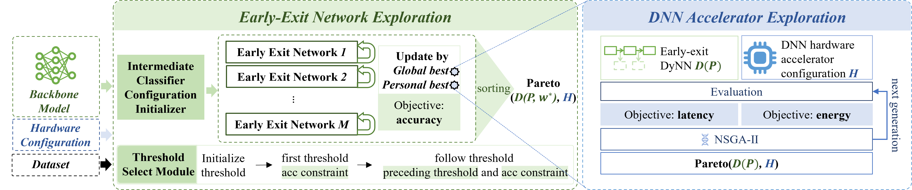
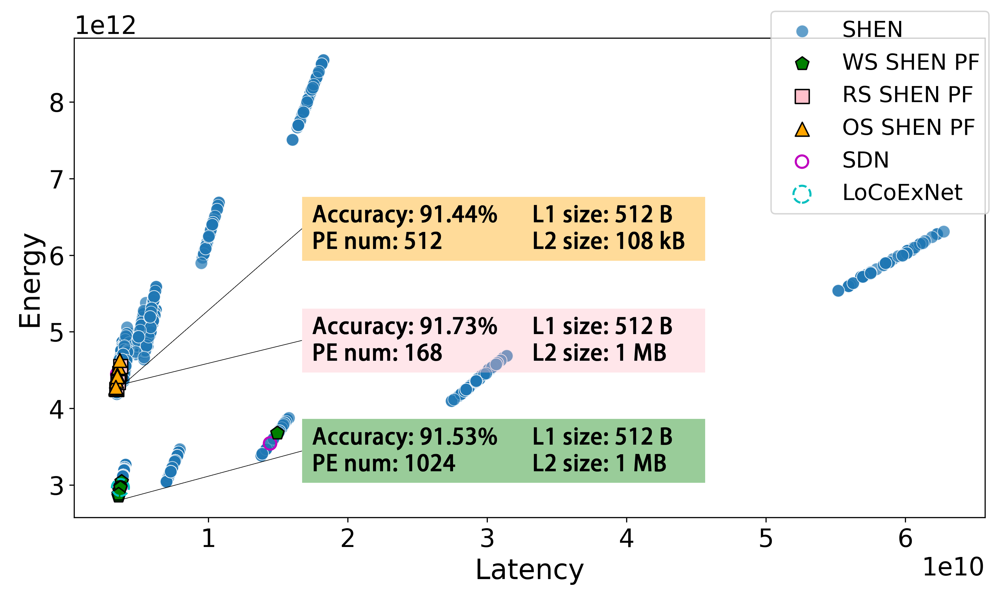

# SHEN: Hardware-Software Co-Exploration of Early-Exit Neural Networks and Edge accelerators

This repository provides the implementation of **SHEN**, which explores the configurations of an Early-Exit(EE) network on customizable edge accelerators. 

Our framework is based on:
- **[Shallow-Deep-Networks](https://github.com/yigitcankaya/Shallow-Deep-Networks)**: Provides the foundation for Early-Exit networks construct and training.
- **[MAESTRO](https://github.com/maestro-project/maestro)**: Provides an analytical cost model evaluating DNN mappings (dataflows and tiling).
## 🚀 Overview
SHEN is illustrated below:
<p align="center">
  
</p>
Key highlights of our approach:

- SHEN explored the configurations of both DyNNs and DNN accelerators to reduce latency and energy consumption while optimizing accuracy. 
- SHEN proposed a new method to explore the optimal number and positions of ICs for a given backbone model. 
- SHEN used a genetic algorithm to explore the optimal configuration of the accelerator.

Required datasets:
- CIFAR-10, CIFAR-100 (downloaded automatically)
- TinyImageNet

## 📂 Repository Structure

├── EarlyExitNetwork/ --- EE networks creating and training\
│   ├── architectures/ --- CNN backbones and EE networks\
│   ├── w_maestro/ --- transfer EE network to maestro modelfile\
│   ├── aux_funcs.py --- auxiliary functions\
│   ├── data.py --- Dataset processing scripts \
│   ├── early-exit_experiments.py --- evaluate EE networks\
│   ├── model_funcs.py --- implements the functions for training and testing EE networks\
│   ├── network_architectures.py --- contains the functions to create and save EE networks\
│   ├── profiler.py --- compute GFLOPs and num params of EE networks\
│   └── train_networks.py --- train EE networks via SDN-training strategies\
├── search_algo/ \
│   ├── remote_eval/ --- connect meastro and receive latency/energy\
│   ├── config.py --- config utilities for yml file\
│   ├── config_evo.yml --- project settings\
│   ├── eenno_pso_nsga_search.py --- main script\
│   ├── utils_eval.py --- utility functions to read/write results\
│   ├── utils_opt.py --- functions for the genetic algorithms\
│   └── utils_pso.py --- functions for adjusting the intermediate classifiers (ICs)\
├── search_space/ \
│   └── eex_hw_search_space.py --- search space definition\
└── README.md --- Project documentation \
└── requirements.yml --- Environment


## 🔧 Installation & Setup
1️⃣ Clone the Repository
First, clone this repository to your local machine:
```bash
git clone https://github.com/qianying-gong/SHEN.git
cd SHEN
```
2️⃣ Install Dependencies
Make sure you have the required dependencies installed:
```bash
pip install -r requirements.yml
```
3️⃣ Configure MAESTRO

This project requires MAESTRO for hardware configuration evaluations. Follow [MAESTRO Website](https://maestro.ece.gatech.edu/). 

4️⃣ Configure config_evo.yml

Before running the main script, set up the required parameters in config_evo.yml.

5️⃣ Run the Experiment

Once MAESTRO is set up and config_evo.yml is properly configured, execute the main script:
```bash
python3 eenno_pso_nsga_search.py 
```
## 📈 Experimental Results
<p align="center">
  
</p>

#### Figure 2: Comparison of different design points obtained from SHEN, SDN and LoCoExNet for ResNet-56 on CIFAR-10. Latency is measured in cycles and energy is measured in nanojoules (nJ).

---

#### Table 3: Energy-delay product (EDP) Reduction of SHEN compared with the backbone model and the reference approaches
|                              Model                               | CIFAR-10 | CIFAR-100 | TinyImageNet |
|:----------------------------------------------------------------:|:----------:|:----------:|:----------:|
|                           **Backbone**                           | 85.91%   | 62.98%     | 52.35%     |
| **[SDN](https://github.com/yigitcankaya/Shallow-Deep-Networks)** | 10.66%    | 7.53%      | 41.77%     |
|                        **[LoCoExNet](https://ieeexplore.ieee.org/abstract/document/10143348)**                         | 8.98%     | 7.36%      | 27.90%      |

**Key Takeaways:**
- SHEN achieves **higher accuracy with lower EDP** compared to SDN and LoCoExNet.
- Although all methods use the same accelerator, **better DyNN configurations improve efficiency**.
## 📝 License
This project is licensed under the MIT License - see the LICENSE file for details.

## 🤝 Acknowledgements
We appreciate the contributions of the following projects: 
- [Shallow-Deep-Networks](https://github.com/yigitcankaya/Shallow-Deep-Networks)
- [MAESTRO](https://github.com/maestro-project/maestro)
